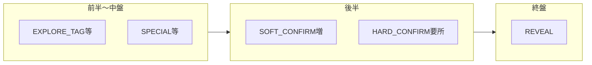

# 早期失敗・後半質問・体験改善 設計書（v2）

対話で整理した**合意事項（修正点）**、**提言**、**プロダクト側の感想**、および**今後の課題**を一次記録とする。実装の優先順位付けと、既存ドキュメントとの役割分担のための文書である。

---

## 0. 文書の位置づけ

- **本書（v2）**: 早期失敗の**判定ロジック方針**、後半の**質問選択の改善方向**、体験改善項目の**採否**を記載する。
- **[DESIGN-early-exit-admin-sim-v1.md](./DESIGN-early-exit-admin-sim-v1.md)**: 管理画面コンフィグとシミュ詳細の**UI／データ形の契約**として残す。早期失敗が「3指標」から「2条件 AND」等へ変わったあとは、本書 §1.6 の差分を反映して追従する。v1 内の「3指標」「`getConfidenceDelta5`」前提の記述は、実装完了までは**現行実装の説明**、完了後は **deprecated 扱い**とする。

---

## 1. 早期失敗の基準と閾値（実装見据え）

### 1.1 合意した方針（修正点）

| 項目 | 現状 | 変更後 |
|------|------|--------|
| 条件③ | `getConfidenceDelta5` による代理値（実運用上ほぼマッチしない） | **廃止**（判定・コンフィグ・管理UI・シミュ表示から除去） |
| 発動条件 | `requiredConditions` 例: 3条件中2マッチ | **①と②の両方を満たすときのみ**（論理 AND）。条件が2つになるため `requiredConditions` は **2 固定**にするか、フィールドを整理して「両方必須」と明示 |
| ②の意味 | `effectiveCandidates > maxEffectiveCandidates`（候補が**広すぎ**） | **候補が十分狭いのに確度が上がっていない**ことを示す条件へ変更。実装では `maxEffectiveCandidates` の**意味を反転**するか、キーを **`maxNarrowCandidates`**（等）にリネームし **`effectiveCandidates <= 閾値`** でマッチとする |

**提言（初期値のたたき台）**: 審査点ごとに「狭い候補」の閾値を段階的に緩める（例: Q25→15、Q30→20、Q35→25、Q40→30 前後）。①の `minConfidence` はバッチシミュで**誤切り**と**見逃し（40問張り付き）**のバランスを見ながら調整する。

**プロダクト側の感想**: 現状の②は「候補が広い」ときにマッチしやすく、①だけマッチするケースが多い。早期失敗の意図は「詰み」の検知であるため、②を**狭いのに決まらない**側へ寄せるのが目的に合う。

### 1.2 判定式（実装後のイメージ）

- **①** `confidence < threshold.minConfidence`
- **②** `effectiveCandidates <= threshold.maxNarrowCandidates`（名前は実装で確定。現 `maxEffectiveCandidates` の再利用は可だが**比較方向とラベル**を UI で誤解ないよう直す）
- **早期失敗** 審査点かつ **① AND ②**

### 1.3 実装タッチポイント（必須）

- `src/server/game/engine.ts` — `getEarlyExitStepSnapshot`: `getConfidenceDelta5` / `matchFlatDelta5` の除去、`matchWideCandidates` の式・命名の変更、`matchedCount` / `wouldEarlyExit` を 2 条件 AND に整合
- `config/mvpConfig.json` — `flow.earlyExitReview.thresholds`・`requiredConditions`
- `src/server/config/schema.ts` — Zod
- `src/app/admin/tags/tabs/ConfigTab.tsx` — ラベル・説明（日本語ファイルの編集ルールに注意）
- `src/types/earlyExitStepSnapshot.ts` — ③関連フィールドの整理
- `src/app/admin/utils/earlyExitReviewMerged.ts` — シミュ列の OK 判定（①②のみ）
- `src/app/admin/components/SimEarlyExitColumnCell.tsx` / `SimEarlyExitThresholdsSummary.tsx` — ③列・閾値サマリの整理
- `src/app/admin/tags/page.tsx` — 表の列（日本語含む場合は UTF-8 経路で編集）
- `src/server/simulation/simulationRunner.ts` / `src/app/api/admin/simulate/route.ts` — スナップショット付与の整合
- 本番 DB: 列追加があれば `scripts/ensure-prod-columns.js`（プロジェクトルールに従う）

### 1.4 受け入れ基準

- 本番 `shouldEarlyExit`（または同等の単一関数）とシミュの早期失敗判定が**同一式**であること。
- バッチシミュで代表ターゲットを回し、早期失敗の頻度と**長時間プレイの張り付き**が許容範囲かを確認してから閾値を確定する。

### 1.5 本書と v1 設計書の関係（要約）

- v1 は「シミュに何を載せるか」の枠組みとして有効。ロジック変更後は「2条件」「②の意味」を v1 の表・受け入れ基準に書き換える。

### 1.6 v1／管理画面の追従差分リスト（実装時チェック）

1. 用語表・「3種類のチェック」「3つ中2つ」の記述 → **2条件 AND** に更新
2. `confidenceDelta5` / 直近5問（③）列・閾値サマリの③ → 削除または「廃止済み」注記のみ
3. `EarlyExitStepSnapshot` の `matchFlatDelta5` 等 → 型・表示から除去
4. Config の各 `qK` オブジェクト: ③用 `maxConfidenceDelta5` を削除するか、後方互換のため無視するかを決める
5. ②の JSON キー名・管理画面ラベルを「狭い候補の上限」として再説明

---

## 2. 後半の質問の流れ（問題・改善・断定とのバランス）

### 2.1 問題点（コード上の事実）

- **Confirm 挿入** — `src/server/algo/questionSelection.ts` の `shouldInsertConfirm`: `confidenceConfirmBand`（例: 0.25〜0.7）と `effectiveCandidates <= effectiveConfirmThreshold` により、後半は挿入が起きやすい。
- **SOFT vs HARD** — `selectConfirmType`: `confidence >= hardConfidenceMin`（例: 0.45）で HARD 優先。`confidence < softConfidenceMin`（例: 0.25）は **HARD 固定**（コメント: 低信頼時の SOFT 無駄打ち防止）。DERIVED が枯渇すると SOFT に行けず HARD へ。
- **HARD 直挿入** — `src/server/game/engine.ts`: Q21 以降 `hardConfirmInjectionRatio`（既定 0.25）で、Confirm 分岐より先に HARD を試す。
- **2 連続 HARD 防止** — 直前が HARD のとき EXPLORE にフォールバックするため、**HARD と EXPLORE が交互**に見え、「みだれうち」感につながる。

### 2.2 改善方針（提言）

- **SOFT を増やす**: `softConfidenceMin` の見直し、低確度時の **HARD 固定フォールバック**の緩和（SOFT 用データがあれば SOFT を選ぶ）、DERIVED 以外のタグプール拡張は**別タスク**で検討。
- **HARD は「ここぞ」**: `hardConfirmInjectionRatio` の低減、または挿入条件の厳格化（**シンプルなルール**に限る）。
- **断定（REVEAL）とのバランス**: 下図のように、EXPLORE／SOFT で情報を取り、確度が乗った局面で HARD または REVEAL が来る**リズム**を目標とする。パラメータは `revealThreshold`、`maxQuestions`、`getEffectiveMaxQuestions` と連動して調整する。

### 2.3 明示的に採用しないもの（プロダクト判断）

- **「直近10問で HARD 最大3回」** のような**窓ベースの回数上限**は、運用・実装の複雑さのため**今は入れない**。

---

## 3. 体験改善の提言と採否（A〜F）

| ID | 内容 | 採否・優先 | プロダクト側の感想 |
|----|------|------------|-------------------|
| A | 進捗の可視化（温度計的な演出） | **既存に近い実装あり。アップデート余地あり** | 採用方向だが優先度は中 |
| B | HARD 連打の体験悪化 | **§2 の SOFT／HARD 設計で改善を図る** | 数的上限ルール（窓ベース）は不採用 |
| C | 質問カテゴリの多様性（連続同カテゴリ抑制など） | **今は不採用** | 現状そこまで問題ではないと判断 |
| D | FailHub 遷移の共感・表現（打ち切りではなく伴走） | **高優先** | 本節のうち**最優先**で仕様化・実装したい |
| E | REVEAL を2択化する等 | **検討アリ** | ありうる。別途ゲームルール影響を要検討 |
| F | 質問数の短縮・早期カット一般論 | **本書 §1 の主眼と切り離して理解する** | アキネイター的発想では、マイナー作品は質問数が多くなることは許容。**価値は「それでも確実に当てる」こと**にある |

---

## 4. 今後の課題（バックログ）

1. **早期失敗**: 閾値のバッチシミュによる定量化。③除去後の管理画面・型・ドキュメントの一貫更新（§1.6 チェックリスト）。
2. **後半質問**: `selectConfirmType` / `shouldInsertConfirm` / `hardConfirmInjectionRatio` のパラメータを変えた前後の **A/B 比較指標**（主観プレイ＋シミュ集計）を別メモで定義。
3. **UX-D（FailHub）**: コピー・レイアウト・遷移の仕様化と実装タスク化。
4. **UX-E（REVEAL 2択など）**: 失敗時ペナルティ・確度更新・体験への影響を別紙で検討。

---

---

## 5. 第1弾実装スコープ（2026-04-04 反映）

以下をコード・`mvpConfig` に反映済みとする（詳細は git 履歴・`backup/pre-early-exit-ux-20260404-152810/` 参照）。

- **早期失敗**: 条件③廃止。①低確度 AND ②「狭さ」（`effectiveCandidates <= maxEffectiveCandidates`）の解釈に統一。`requiredConditions` は 2。管理シミュ表は「確度（①）」「候補（②）」列の緑判定と「早期失敗判定」列のみ（旧「直近５問」列は削除）。
- **後半質問**: `selectConfirmType` で SOFT データがあれば高確度以外は SOFT 優先、`hardConfirmInjectionRatio` 引き下げ（例: 0.1）。
- **UX-D（FailHub）**: `gameCopy` に `failListBtnNotInList` / `failListBtnRecommend` / `failListBtnTop` / `failListSearchIntro` / `failListSearchPlaceholder` を追加し、`FailList` で表示。`/api/config` GET の `gameCopy` は `DEFAULT_GAME_COPY` と浅くマージし欠損キーを防ぐ（`/api/config/game-ui`・`/api/start` は従来どおりマージ済み）。

**今後検討（本書 §2〜4 の残り）**: 窓ベース HARD 上限、REVEAL 2択化、進捗演出の強化、閾値のバッチ定量化など。

## 改訂履歴

| 日付 | 内容 |
|------|------|
| 2026-04-04 | 初版（対話合意の設計書化） |
| 2026-04-04 | §5 第1弾実装スコープの追記 |
