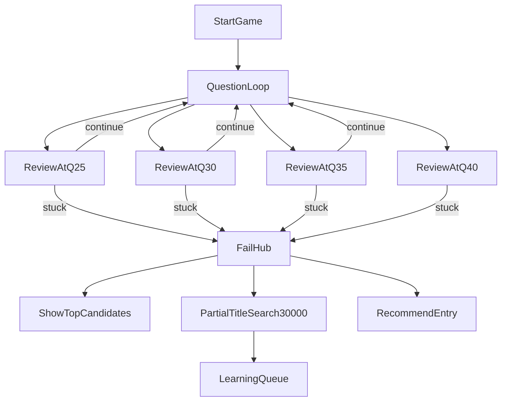

# エロネイター再設計書（問題固定先行・v2）

**版**: v2.0  
**日付**: 2026-04-02  
**目的**: 「なぜ改善するか」を先に固定し、手段先行の迷走を防ぐ。実装前に問題定義・優先順位・評価指標を凍結する。

---

## 1. この改善の目的（固定）

本リニューアルは次の3目的を同時に満たすために行う。

1. **有名作品は短い質問数で当てる**（既存強みの維持）
2. **無名作品も質問数は増えてよいが特定可能にする**（探索性能）
3. **当てるまでの流れを「作業」ではなく「遊び」にする**（体験価値）

注意: v1.5 で入れた新タグ質問は「③を補助する手段」であり、**本質課題の主解ではない**。

---

## 2. 問題固定（P0 / P1 / P2）

以下は設計前に固定する。順序は実装優先度そのもの。

### P0-1: DB外作品に対する40問無駄打ち

- **現象**: 実在作品でも運用DB外だと終盤まで空振りし、長い失敗体験になる。
- **原因**: 失敗後の照合導線が弱く、「当てられない状態」の早期救済がない。
- **悪影響**: ①②③すべてを損なう。ユーザーは「AIが弱い」と感じる。
- **解決方針**:
  - 失敗/早期打ち切り画面で **タイトル部分検索（運用外3万件含む）** を提供。
  - 候補はタイトル + サムネで提示し、全入力を要求しない。
  - 選択された作品を「学習候補」として保存し、運用DB昇格判断に使う。
- **成功判定**:
  - 失敗セッションで検索利用率が一定以上（例: 40%+）。
  - 「見つからず離脱」率が減少。

### P0-2: 詰み判定不足（Q20〜Q25で切れない）

- **現象**: 確度が伸びないまま質問を重ねる。
- **原因**: 「続行価値がない状態」の判定が曖昧/未実装。
- **悪影響**: 体感は単調化し、終盤の質問が情報価値を持ちにくい。
- **解決方針**:
  - 審査ポイント（Q25, 30, 35, 40）で詰み判定。
  - Q25は厳しめ、以降は調整可能にする。
  - 詰み時は続行せず、失敗UI（候補 + 検索 + 推薦導線）へ遷移。
- **成功判定**:
  - 低確度セッションの平均質問数が短縮。
  - 早期遷移後の再利用率（検索/推薦遷移）が増加。

### P0-3: 後半の弾切れと「当てにいく質問」空振り連打

- **現象**: 頭文字/作者系が続くが確度が動かないケースがある。
- **原因**: 探索候補の枯渇時に、代替としてズルい質問が繰り返される。
- **悪影響**: 「総当たり感」が強くなり、②③双方で不利。
- **解決方針**:
  - ズルい質問は「候補が十分絞れた局面」でのみ強化。
  - 絞れていない局面では詰み判定へ寄せる。
  - 救済スロットは `mvpConfig` で調整可能に維持する。
- **成功判定**:
  - 終盤の「確度非変化質問」の比率を減少。
  - 頭文字/作者質問の出題が「中高確度帯」に偏る。

### P1-1: いいえ連続で体験が単調化

- **現象**: 後半に NO が続き「作業感」が増える。
- **原因**: 質問種類の制約 + 後半選択の硬直。
- **解決方針**:
  - 新タグ質問（現代日本/男主人公/原作アリ）を体験緩和枠として維持。
  - 「大半がYESになりやすい質問」を中盤に少数固定。
- **成功判定**:
  - 連続NOの最長値中央値を改善。
  - 継続率（Q10→Q20）が向上。

### P1-2: ノイズ回答/非特定作品意図の取り扱い不足

- **現象**: 作品特定意図が薄いユーザーでも通常フローを継続してしまう。
- **原因**: 推薦導線の出し分け条件が弱い。
- **解決方針**:
  - 既存ノイズ誘導を維持しつつ、詰み判定側でも推薦導線を統合。
  - 「特定作品でない」ケースの出口を明確化。
- **成功判定**:
  - ノイズ誘導後の推薦遷移率が増加。
  - 適合しないセッションの長時間化を抑制。

### P2-1: 新タグ蓄積ループの運用未完成

- **現象**: 新タグは導入したが、DB育成への反映が弱い。
- **原因**: 「回答履歴→タグ候補→昇格判定」の運用仕様が未確立。
- **解決方針**:
  - 失敗時検索で確定した作品を学習対象に保存。
  - 自動反映は慎重運用（誤学習防止）で段階導入。
- **成功判定**:
  - 新規タグ候補の蓄積数と採用率を追跡できる。

---

## 3. 解決策の全体像（本質優先）

---

## 4. 仕様（固定部分）

### 4.1 質問フローの主原則

- 新タグ質問は維持（Q2/Q7/Q13 既定）するが、主目的は体験補助。
- 特別質問枠は現行実装整合を維持（Q3/Q5/Q9/Q12 + Q11補填 + Q16/20/24救済）。
- 詰み判定に入ったら、ズルい質問連打より失敗ハブへ分岐。

### 4.2 失敗ハブ（FailHub）

- 上段: 候補作品（既定5件）
- 下段: 3万件を含むタイトル部分検索（デバウンス付き）
- 右導線: 推薦モード（押し付けない）
- 検索選択時: セッション回答履歴との紐付け保存

### 4.3 早期分岐（審査）

- 審査点: Q25/Q30/Q35/Q40
- 判定ロジック: コンフィグで数値調整可能（例: 確度、実効候補数、直近変化量）
- Q25は厳しめ、後半は緩和可能

### 4.4 早期分岐の判定契約（実装用）

- 審査対象 `qIndex`: 25 / 30 / 35 / 40
- 判定入力:
  - `confidenceTop1`: トップ候補確度（0〜1）
  - `effectiveCandidates`: 実効候補数
  - `confidenceDelta5`: 直近5問の確度変化量（絶対値）
- 判定ルール（初期）:
  - 次の3条件のうち2条件以上で `stuck = true`
    1. `confidenceTop1 < threshold.minConfidence`
    2. `effectiveCandidates > threshold.maxEffectiveCandidates`
    3. `confidenceDelta5 <= threshold.maxConfidenceDelta5`
- ステージ別閾値:
  - Q25は厳しめ（早めに打ち切る）
  - Q30/Q35/Q40は調整可能（既定値は `mvpConfig`）

### 4.5 FailHub 遷移契約（実装用）

- `stuck = true` の場合、次質問生成を停止して FailHub へ遷移
- FailHub 表示要素:
  - `topCandidates`: 候補5件（`workId`, `title`, `thumbUrl?`）
  - `searchBox`: 部分検索入力（デバウンス 300ms）
  - `recommendEntry`: 推薦モード導線（**表示はするが補助導線**）
- FailHub でユーザーが作品選択した場合:
  - `selectedWorkId`
  - `selectedFrom` (`topCandidates` or `search`)
  - `sessionQuestionHistory`
  を紐づけ保存する

### 4.6 API 契約（実装用）

#### 4.6.1 タイトル部分検索

- Endpoint: `GET /api/works/search?q={query}&limit={n}`
- Input:
  - `q`: 1文字以上（前後空白はトリム）
  - `limit`: 既定10、最大20
- Output:
  - `works[]`: `{ workId, title, thumbUrl?, source: "active" | "reserve" }`
- ルール:
  - 部分一致（タイトル途中一致）
  - reserve（運用外3万件）を**全件対象に含める**
  - 空クエリは空配列を返す

#### 4.6.2 失敗時選択保存

- Endpoint: `POST /api/failhub/select`
- Input:
  - `sessionId`, `workId`, `selectedFrom`, `query?`
- Output:
  - `{ ok: true, learningQueued: boolean }`
- 副作用:
  - セッション履歴（回答ログ全体）と選択作品を紐づけ保存
  - 学習候補キューへ積む（P2）
  - 当面運用は「まず全保存」を前提とする（プレイ履歴1000件規模までは保持）

### 4.7 config キー（v2 追加/整理）

- `flow.earlyExitReview`（新規）
  - `enabled`
  - `reviewIndices`（既定: `[25,30,35,40]`）
  - `thresholds`（`q25`, `q30`, `q35`, `q40`）
  - 各 threshold:
    - `minConfidence`
    - `maxEffectiveCandidates`
    - `maxConfidenceDelta5`
    - `requiredConditions`（既定: `2`）
- `failHub`（新規）
  - `enabled`
  - `candidateCount`（既定: `5`）
  - `searchDebounceMs`（既定: `300`）
  - `searchLimitDefault`（既定: `10`）
  - `searchLimitMax`（既定: `20`）
- `newTagQuestions`（既存維持）
  - `enabled`
  - `slotIndices`（既定: `[2,7,13]`）
  - `variants[]`
- `noiseGuideRecommend`（既存維持）
  - `enabled`
  - `questionText`

### 4.8 推薦導線の確定仕様（主従）

- **主導線**: タイトル系UNKNOWN条件（ノイズ質問）から推薦へ
  - 表示場所: 通常の質問画面
  - 質問文: 「もしかして…タイトルや作品にこだわりがない？なら私からおススメを推薦するわよ？」
  - 選択肢: `YES` / `NO` のみ
  - `YES` → 推薦プレイへ遷移
  - `NO` → トップへ戻る
- **補助導線**: FailHubにも推薦ボタンは表示（主導線ではない）

### 4.9 早期分岐の初期閾値（初期値・後で調整可）

- 方針: **Q25は厳しめ**、以降は段階的に緩める
- 初期値（`requiredConditions = 2`）
  - `q25`: `minConfidence=0.20`, `maxEffectiveCandidates=45`, `maxConfidenceDelta5=0.040`
  - `q30`: `minConfidence=0.16`, `maxEffectiveCandidates=60`, `maxConfidenceDelta5=0.035`
  - `q35`: `minConfidence=0.13`, `maxEffectiveCandidates=80`, `maxConfidenceDelta5=0.030`
  - `q40`: `minConfidence=0.10`, `maxEffectiveCandidates=100`, `maxConfidenceDelta5=0.025`

---

## 5. 実装フェーズ（P0→P1→P2）

### フェーズP0（先に実装）

1. 早期分岐（Q25/30/35/40）と失敗ハブ遷移
2. タイトル部分検索API（運用外3万件を含む）
3. 失敗ハブUI（候補 + 検索 + 推薦導線）

### フェーズP1（次に実装）

4. 新タグ質問3問の運用安定化（主目的を補助に限定）
5. ノイズ誘導の条件見直しと推薦統合

### フェーズP2（拡張）

6. 検索選択作品の学習キュー化
7. 新タグ/昇格運用（手動レビュー中心）をループ化

### 5.1 対象ファイル別の実装責務

- `src/server/game/engine.ts`
  - 審査ポイント判定の実装
  - `stuck` 判定時の遷移フラグ生成
  - 「絞れていない局面でズルい質問を抑制」の優先制御
- `src/server/config/schema.ts`
  - `flow.earlyExitReview` / `failHub` の Zod 追加
- `config/mvpConfig.json`
  - 既定値（reviewIndices, thresholds, failHub）追加
- `src/app/api/works/search/route.ts`（新規想定）
  - reserve を含む部分一致検索API
- `src/app/api/failhub/select/route.ts`（新規想定）
  - 選択作品保存API
- `src/app/components/*`（FailHub UI）
  - 候補5件表示、検索入力、推薦導線
- `src/app/api/answer/route.ts`
  - `stuck` フラグ伝播、FailHub 遷移情報返却

### 5.2 導入順（壊さない順序）

1. config/schema 追加（未使用でも起動可能状態）
2. engine に審査ロジック追加（feature flag off）
3. 検索API + 保存API 追加
4. FailHub UI 接続
5. feature flag on で段階リリース
6. 最後に新タグ/ノイズの微調整

---

## 6. 受け入れ基準（設計レビュー）

次の条件を満たさない限り、実装を開始しない。

1. **P0各課題に**「検知条件」「分岐」「画面遷移」「保存データ」が定義済み
2. 新タグ質問が「補助手段」であることが明記され、主解と混同されていない
3. 早期分岐と検索導線が、40問無駄打ちを減らす構造になっている
4. 可変要素は全てコンフィグ項目に落とし込み済み

---

## 7. 計測指標（実装後検証）

- 失敗セッション平均質問数
- 失敗セッション検索利用率
- 検索経由での作品選択率
- 推薦モード遷移率（失敗ハブ経由）
- Q20以降で確度が動かない質問比率
- 連続NOの最長値中央値
- Q25以前の早期離脱率（改善後の悪化有無確認）
- FailHub から推薦モードへ進んだ比率

---

## 8. 非目標（今回はやらない）

- 演出・キャラ台詞の大幅刷新
- いきなり4万件を運用DBに投入
- 自動タグ付けの全面自動化（誤学習リスクが高いため）

---

## 9. Go / No-Go（実装開始ゲート）

次が未確定なら実装を開始しない。

1. `flow.earlyExitReview` の閾値初期値
2. 検索対象データソース（reserve 3万件）の参照方式
3. FailHub で保存する最小データ項目（監査可能性）

